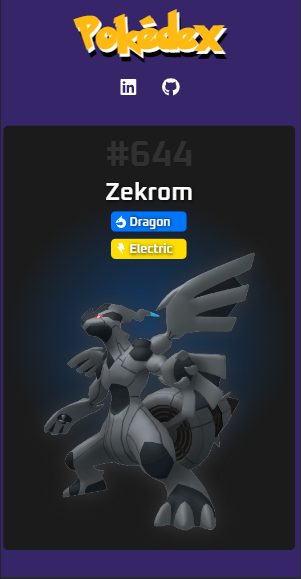
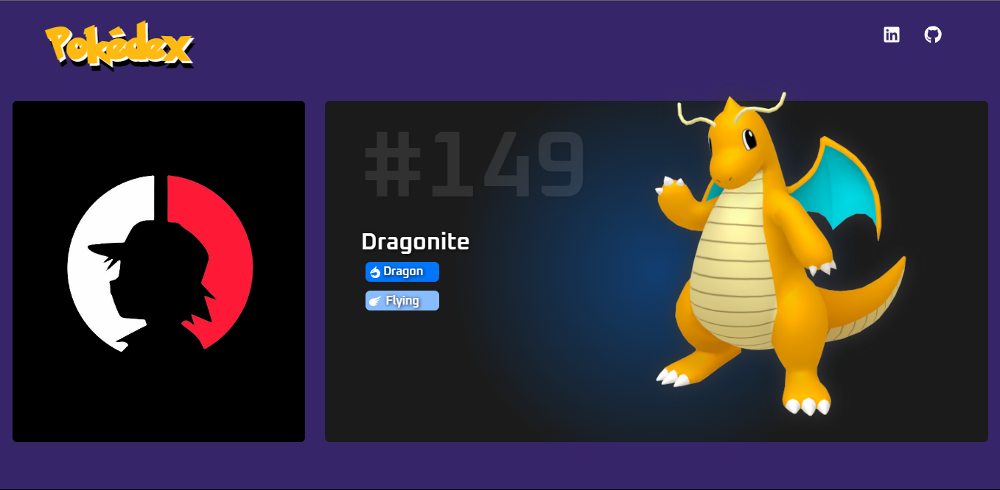
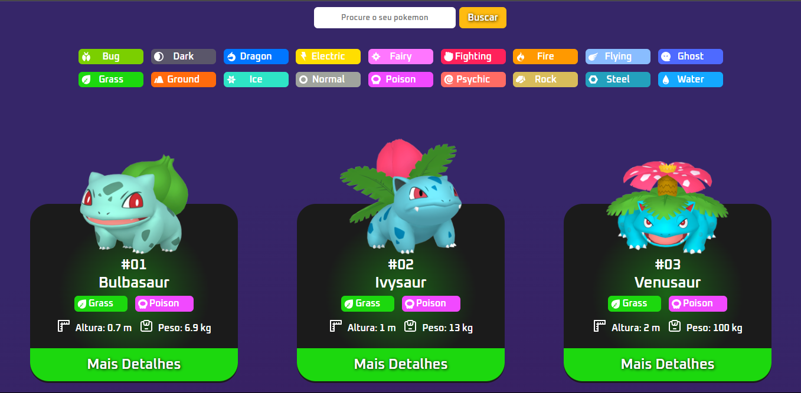
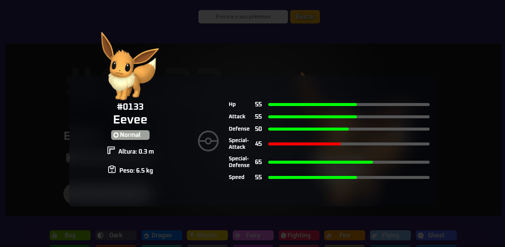

    
    
    
    

#

<h1>Pokedex-React    
</h1>

## Descrição

https://pokedex-snowy-seven.vercel.app/

#### Criação da famosa Pokédex, colocando em prática meus conhecimentos iniciais com React, antes tinha criado esse projeto usando JavaScript puro e agora resolvi adaptar ao React.

#

## Layout mobile

## Layout web
  

 

# Tecnologias

<ul>
    <li style="list-style: none;">
    <a href="https://create-react-app.dev/" target="_blank">React</a></li>
    <li style="list-style: none;">
    <a href="https://reactrouter.com/" target="_blank">React Router</a></li>
</ul>

 

# ℹ️ Como usar

    Clone esse repositório
    $ git clone https://github.com/renovatt/pokedex-react.git

    Instalar dependências
    $ npm install

    Inicie o projeto
    $ npm start

 

# Como contribuir?

#### Você pode dar suporte me seguindo aqui no GitHub, dando uma estrela no projeto ou criar uma conexão comigo no linkedin, fazendo parte da minha Networking e curtir o meu projeto.

 

# Autor

### Criado por <a href="https://www.linkedin.com/in/renovatt/" target="_blank">*Wildemberg Renovato de Lima*</a>